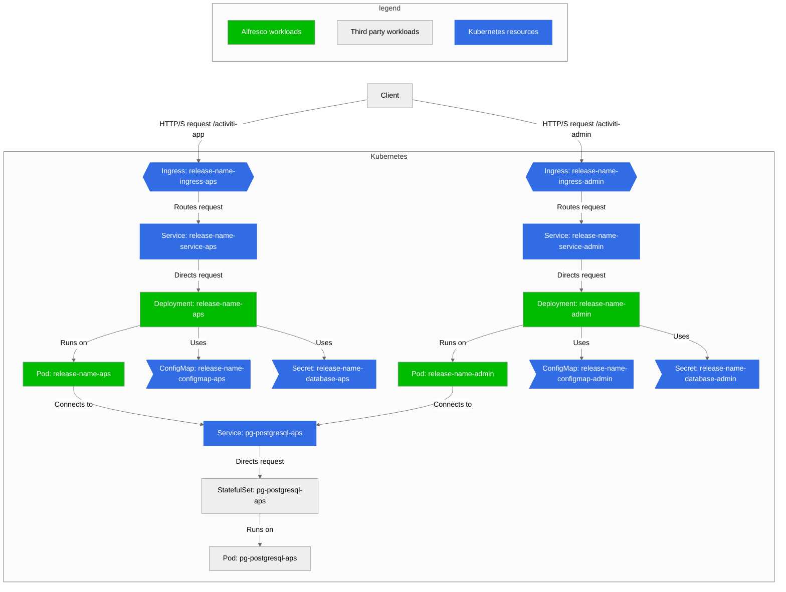
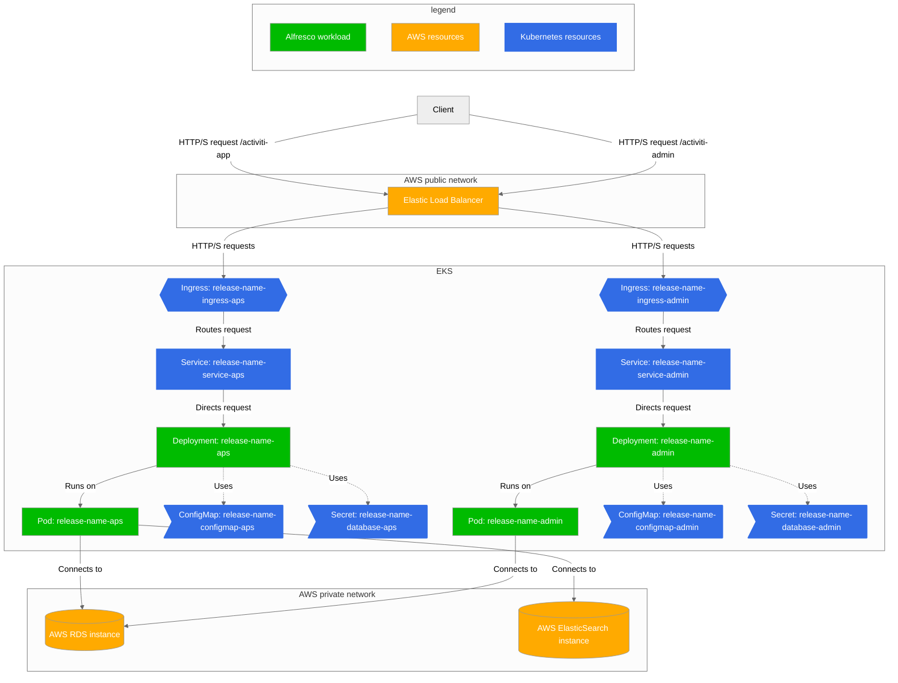

# Alfresco Process services architecture

Below is a representation of a fully in-cluster Kuerbenetes deployment of APS.

## AWS example deployment

Below is a representation of a deployment of APS which leverages AWS services.

